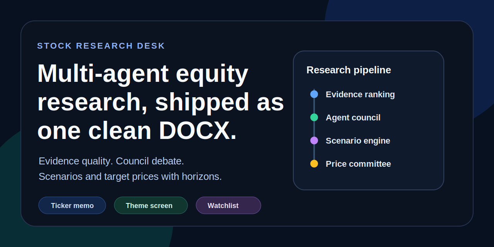

# Stock Research Desk



A cloud-only multi-agent equity research desk for single-name deep dives, theme screening, recurring watchlists, and bilingual document delivery.

Turn one ticker or one theme into a staged research process:

- deep research for one stock
- theme / sector screening with initial filter, second filter, and finalist deep dives
- recurring watchlist analysis on a fixed cadence
- email-driven interaction through a mailbox like QQ Mail
- an additive Codex-native operating mode with Codex web research and automation-ready watchlists

Open the fastest public examples:

- [Sample Research Memo](docs/sample-memo.md)
- [Case Study: SaiTeng](docs/case-study-saiteng.md)
- [Sample Screening Summary](docs/sample-screening.md)
- [CLI Workflow](docs/cli-workflow.md)
- [Codex Skill Mode](docs/codex-skill.md)

The repo now supports two host modes:

- terminal-first cloud execution through Ollama Cloud
- Codex-native execution where Codex becomes the main brain, uses its own web research first, and can write separate Chinese and English DOCX outputs to the desktop workspace

In practice, that means you can use it in four ways:

- type one stock into the terminal and get a buy-side-style memo
- give it a sector direction and let it narrow candidates before expensive deep work
- treat your mailbox like a lightweight research command queue
- add Codex as an extra operating layer without changing the original CLI flow

## At A Glance

| Need | Best mode | Output |
| --- | --- | --- |
| One stock, full debate-oriented memo | terminal CLI | zh/en DOCX + JSON |
| Theme triage before expensive deep work | terminal CLI | screening DOCX + finalist memos |
| Hands-off recurring refreshes | watchlist + mailbox | digest DOCX + refreshed memos |
| Codex as planner and main brain | Codex skill | same document bundle, different host path |

## What It Is

This is a terminal-first research desk for one-name equity work.

It is built for the moment after an idea becomes interesting but before you trust yourself to size it. Instead of giving you one smooth paragraph, it runs a staged process:

- evidence-ranked market and company research
- investor-style analyst personas
- red-team challenge and disagreement capture
- MiroFish-style future branches
- explicit short-, medium-, and long-term target prices
- watchlist memory and recurring refresh cycles


## Why It Feels Different

Most AI stock tools stop at one of these layers:

- search aggregation
- memo generation
- sentiment scraping

This repo stacks them into one debate-oriented workflow:

- source ranking before synthesis
- multi-agent passes instead of one-shot summary
- committee debate before conclusion
- scenario projection before target prices
- sector screening before expensive deep work
- memory snapshots so repeat runs accumulate context instead of restarting cold

If you want a quick feel for the output surface, open:

- [Sample Research Memo](docs/sample-memo.md)
- [Case Study: SaiTeng](docs/case-study-saiteng.md)
- [Sample Screening Summary](docs/sample-screening.md)
- [Email Briefing Modes](docs/email-briefings.md)
- [Source Quality Model](docs/source-quality.md)

## Why This Exists

Most AI stock tools fail in one of two ways:

- they are shallow wrappers around web search
- they produce confident prose without enough internal debate

This repo is designed to be stricter:

- cloud-only research path
- evidence ranking and low-quality source filtering
- multi-agent research instead of one-shot summarization
- red team + guru council + future-scenario layer
- target prices always tied to explicit time horizons
- Ollama `web_search` / `web_fetch` used first, with `cross-validated-search` only as an error fallback

It is intentionally narrow:

- no trading execution
- no portfolio management
- no backtesting engine
- no OpenClaw dependency
- no local-model fallback

## What You Get

- a staged single-name memo instead of a one-shot summary
- sector screening with initial scout, second-screen council, and finalist deep dives
- recurring watchlist refreshes with digest generation
- separate Chinese and English DOCX deliverables for humans
- JSON artifacts for follow-up automation

## Why People Save Repos Like This

- it is narrow enough to be believable
- it exposes disagreement instead of hiding it
- it treats screening and deep research as different budgets
- it delivers separate Chinese and English documents instead of only raw traces
- it keeps a terminal-first path and an additive Codex path in the same repo

## 60-Second Start

```bash
git clone https://github.com/wd041216-bit/stock-research-desk.git
cd stock-research-desk
python3 -m venv .venv
source .venv/bin/activate
pip install -e .[dev]
cp .env.example .env
```

Set your cloud key:

```bash
export OLLAMA_API_KEY="your_ollama_cloud_api_key"
```

Run a first memo:

```bash
./bin/research-stock 赛腾股份 --ticker 603283.SH --market CN --angle "中国故事"
```

The default CLI command writes:

- `~/Desktop/Stock Research Desk/reports/<timestamp>-<ticker>-zh.docx`
- `~/Desktop/Stock Research Desk/reports/<timestamp>-<ticker>-en.docx`
- `~/Desktop/Stock Research Desk/reports/<timestamp>-<ticker>.json`
- `~/Desktop/Stock Research Desk/memory_palace/<ticker>.json`

The separate Codex skill mode uses the same document-first delivery shape:

- `~/Desktop/Stock Research Desk/reports/<timestamp>-<ticker>-zh.docx`
- `~/Desktop/Stock Research Desk/reports/<timestamp>-<ticker>-en.docx`

Run a theme screen:

```bash
./bin/research-stock screen "中国机器人" --market CN --count 3
```

That will:

- do an initial web-based candidate scout
- turn the shortlisted names into mini-dossiers with vertical + horizontal web diligence
- run a multi-stage second-screen guru council on those dossiers
- run full deep research on the finalists
- save a screening summary to `~/Desktop/Stock Research Desk/screenings/`

Add a recurring watchlist entry:

```bash
./bin/research-stock watchlist add 赛腾股份 --ticker 603283.SH --market CN --angle "中国故事" --interval 7d
./bin/research-stock watchlist run-due
```

Enable mailbox interaction:

```bash
export STOCK_RESEARCH_DESK_EMAIL_ADDRESS="your_mailbox@example.com"
export STOCK_RESEARCH_DESK_EMAIL_APP_PASSWORD="your_mailbox_app_password"
./bin/research-stock email run-once
```

Supported email subjects:

- `research: 赛腾股份 | 603283.SH | CN | 中国故事`
- `screen: 中国机器人 | 3 | CN | 中国故事`
- `watchlist add: 赛腾股份 | 603283.SH | 7d | CN | 中国故事`
- `watchlist list`
- `watchlist run-due`

Email replies now come back in desk-style formats and attach the document bundle:

- `Single-Name Desk Note`
- `Screening Brief`
- `Morning Watchlist Brief`
- `Weekly Watchlist Wrap`

## Public Samples

- [Sample Research Memo](docs/sample-memo.md)
- [Case Study: SaiTeng](docs/case-study-saiteng.md)
- [Sample Screening Summary](docs/sample-screening.md)
- [Email Briefing Modes](docs/email-briefings.md)
- [Source Quality Model](docs/source-quality.md)
- [Memo Schema](docs/memo-schema.md)

## Why It Can Be Trusted More Than A Thin Wrapper

- it ranks sources before synthesis instead of trusting every page equally
- it preserves disagreement through red-team and council stages
- it treats target prices as committee outputs tied to time horizons
- it keeps recurring context in a local memory snapshot instead of restarting cold
- it keeps machine-readable JSON next to the human-ready memo

## Full Workflow

The single-name CLI runs a multi-stage desk:

1. `market_analyst`
   Reads the cycle, market structure, China narrative, and valuation frame.
2. `company_analyst`
   Focuses on business quality, customers, financial signals, catalysts, and risks.
3. `sentiment_simulator`
   Simulates multiple participant views from public narrative flow.
4. `comparison_analyst`
   Builds the peer frame and checks whether the name is worth prioritizing.
5. `committee_red_team`
   Forces the breakpoints, weak links, and disconfirming evidence.
6. `guru_council`
   Records consensus, disagreement, and the real verification agenda.
7. `mirofish_scenario_engine`
   Projects bull / base / bear futures with time markers and triggers.
8. `price_committee`
   Produces short-, medium-, and long-term target prices with time horizons.

Every run updates a local `memory_palace/` snapshot so the next pass can continue from prior bull / bear points, open questions, and recent evidence.

For theme screening, the product now uses three layers:

1. initial screen
   Collects candidate names from public-web evidence.
   The model is allowed to plan its own search and follow-up queries.
   Native `web_search` / `web_fetch` are always tried first.
   If a search or fetch tool explicitly errors, the desk falls back to [`cross-validated-search`](https://github.com/wd041216-bit/cross-validated-search) for that step only.
2. second screen
   A stricter multi-stage guru council reviews mini-dossiers, not just a flat candidate list.
   It now runs:
   - a support round to build the strongest why-now cases
   - a red-team round to attack theme fit, valuation, and evidence quality
   - a reconsideration round to decide which names still deserve expensive deep research
3. finalist deep research
   The existing multi-agent memo process runs on each finalist.

For recurring tracking, the product now also maintains:

1. watchlist storage
   Saves cadence, angle, next-run time, and last report path.
2. digest generation
   Each due run can emit a watchlist digest into the desktop workspace.
3. mailbox control
   You can trigger research, screening, and watchlist workflows by email.

## Codex Skill Mode

The repo now ships a Codex skill at:

- [`codex-skill/stock-research-desk/SKILL.md`](codex-skill/stock-research-desk/SKILL.md)

In Codex-native mode:

- Codex is the main brain
- Codex web research is tried first
- `cross-validated-search` is only a fallback when a search/fetch step explicitly errors
- recurring watchlists should be scheduled through Codex automations, not the repo's older internal scheduler
- final deliverables should be kept as separate Chinese and English DOCX reports

This is an additional mode, not a replacement for the default CLI and mailbox workflows. The host mode changes, but final human-readable deliverables stay document-first in both paths.

## Example Output Shape

Each report includes:

- quick take
- market map
- business summary
- sentiment simulation
- peer comparison
- guru council notes
- MiroFish-style future scenarios
- bull / bear / catalysts / risks
- target prices:
  - short term
  - medium term
  - long term

## Configuration

Start from [`.env.example`](.env.example).

Key variables:

| Variable | Default | Purpose |
| --- | --- | --- |
| `OLLAMA_API_KEY` | required | Ollama Cloud API key |
| `STOCK_RESEARCH_DESK_HOME` | `~/Desktop/Stock Research Desk` | default desktop workspace |
| `STOCK_RESEARCH_DESK_MODEL` | `kimi-k2.5:cloud` | default research model |
| `STOCK_RESEARCH_DESK_THINK` | `high` | reasoning depth |
| `STOCK_RESEARCH_DESK_MAX_RESULTS` | `5` | max web search results per step |
| `STOCK_RESEARCH_DESK_MAX_FETCHES` | `6` | max page fetches per step |
| `STOCK_RESEARCH_DESK_TIMEOUT_SECONDS` | `45` | per-call timeout |
| `STOCK_RESEARCH_DESK_OLLAMA_HOST` | `https://ollama.com` | cloud host |
| `STOCK_RESEARCH_DESK_OUTPUT_DIR` | `reports` | report directory under the desktop workspace |
| `STOCK_RESEARCH_DESK_EMAIL_PROVIDER` | `qq` | mailbox preset |
| `STOCK_RESEARCH_DESK_EMAIL_ADDRESS` | optional | inbound / outbound mailbox |
| `STOCK_RESEARCH_DESK_EMAIL_APP_PASSWORD` | optional | SMTP/IMAP authorization code |
| `STOCK_RESEARCH_DESK_EMAIL_IMAP_HOST` | `imap.qq.com` | IMAP host |
| `STOCK_RESEARCH_DESK_EMAIL_IMAP_PORT` | `993` | IMAP SSL port |
| `STOCK_RESEARCH_DESK_EMAIL_SMTP_HOST` | `smtp.qq.com` | SMTP host |
| `STOCK_RESEARCH_DESK_EMAIL_SMTP_PORT` | `465` | SMTP SSL port |

## Evidence Quality Rules

The repo now includes explicit source quality control:

- domain-level source scoring
- blocked-source filtering
- preference for official filings, exchanges, and higher-trust media
- deduplication and relevance filtering for near-name collisions
- fallback memo generation from ranked evidence instead of raw noisy traces

## Showcase Assets

Useful public-facing assets in this repo:

- [Memo Preview](assets/memo-preview.svg)
- [Briefing Preview](assets/briefing-preview.svg)
- [Sample Research Memo](docs/sample-memo.md)
- [Sample Screening Summary](docs/sample-screening.md)
- [Submission Batch 1](docs/submission-batch-1.md)

This does not magically make public web data clean. It does make the workflow more stable and less gullible than a bare search wrapper.

## Docs

- [Sample Research Memo](docs/sample-memo.md)
- [CLI Workflow](docs/cli-workflow.md)
- [Source Quality Model](docs/source-quality.md)
- [Memo Schema](docs/memo-schema.md)

## Testing

```bash
source .venv/bin/activate
pytest -q
```

## Positioning

This is a research assistant, not investment advice.

It is best used when you want:

- one-name deep work
- a debate-oriented memo
- explicit scenario branches
- target prices with time anchors

It is not built for:

- auto-trading
- portfolio construction
- paper trading
- retail hype scraping as a primary signal

## Inspiration

- investor-style analyst decomposition inspired by [virattt/ai-hedge-fund](https://github.com/virattt/ai-hedge-fund)
- multi-future branching inspired by [MiroFish](https://github.com/666ghj/MiroFish)
- runtime resilience influenced by the `openstream` design philosophy
