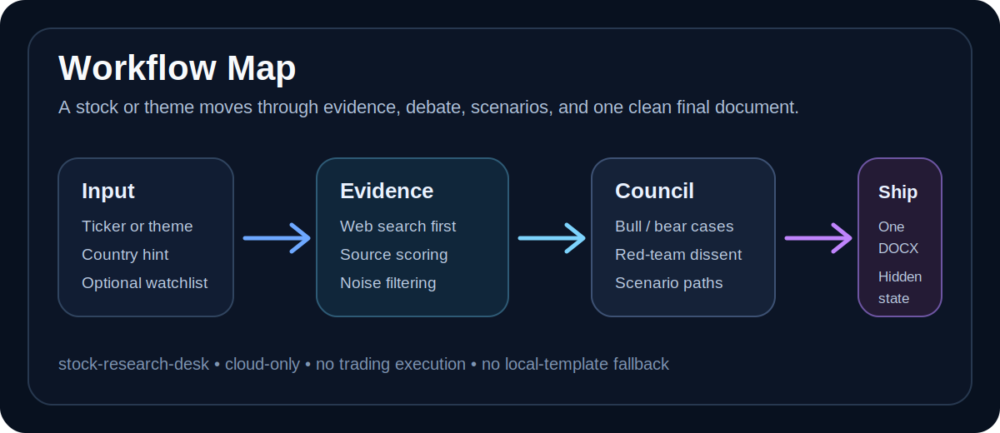
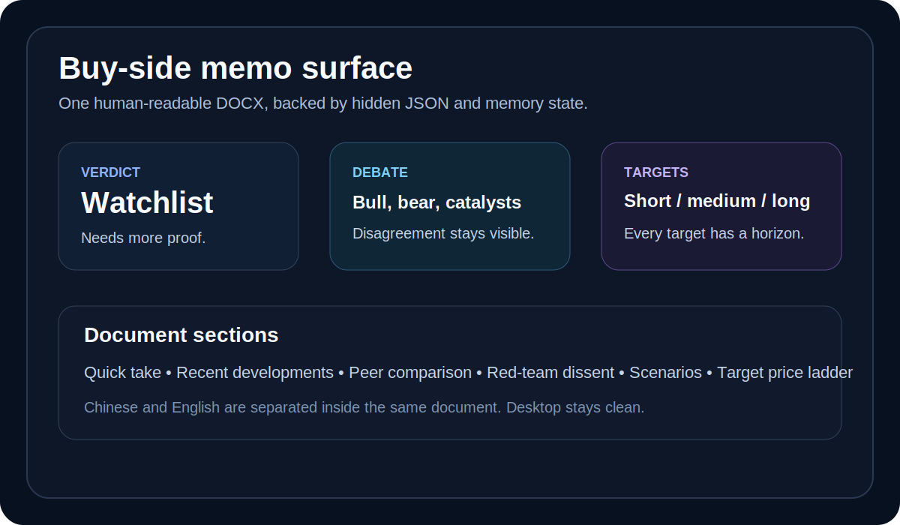

# Project Showcase

`stock-research-desk` is a cloud-only, terminal-first equity research desk.

It is designed for investors and builders who want more than a search summary but do not want a full trading platform.

## The Hook

Give it either:

- one company, such as `赛腾股份 中国`
- one theme, such as `brain-computer interface US`

The workflow returns a document-first research artifact:

- one desktop DOCX for the user
- hidden JSON and memory state for automation
- short-, medium-, and long-term target prices with explicit time horizons
- bull / bear / catalysts / risks / scenario branches

## What Makes It Different

The project is intentionally not a generic chatbot wrapper.

It separates three budgets:

- discovery budget: broad theme screening and candidate normalization
- diligence budget: vertical and horizontal public-web investigation
- conviction budget: red-team, guru council, scenario engine, and price committee

That split keeps a cheap candidate scout from pretending to be a finished buy-side memo.

## Workflow Map

## Report Surface

Every completed report aims to include:

- quick take
- recent developments and volatility clues
- business summary
- peer comparison
- sentiment simulation
- bull case
- bear case
- catalysts
- risks
- red-team dissent
- MiroFish-style scenario paths
- target prices with time horizons
- verification agenda

## Screening Surface

The theme-screening flow does not simply ask for a top list.

It runs:

1. initial candidate discovery
2. candidate-level mini-dossiers
3. second-screen guru council
4. finalist deep-research memos

See [Sample Screening Summary](sample-screening.md).

## Trust Boundaries

This is a research assistant, not investment advice.

It does not do:

- trading execution
- portfolio management
- backtesting
- paid-terminal replacement
- local fallback memo generation when the cloud model chain is unavailable

It does do:

- source quality scoring
- low-quality source filtering
- target-price horizon enforcement
- explicit disagreement capture
- hidden memory state for repeat coverage

## Suggested GitHub Description

Cloud-only multi-agent stock research desk for ticker memos, theme screening, watchlists, and DOCX delivery.

## Suggested Topics

- `stock-research`
- `equity-research`
- `investment-research`
- `multi-agent`
- `ai-agents`
- `financial-analysis`
- `scenario-analysis`
- `ollama`
- `watchlist`
- `buy-side`
